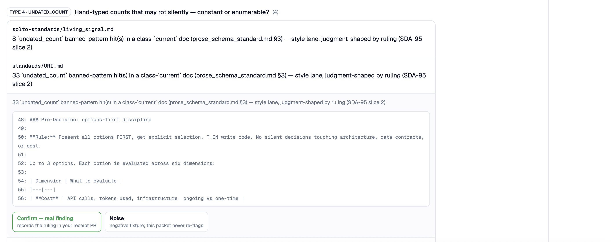
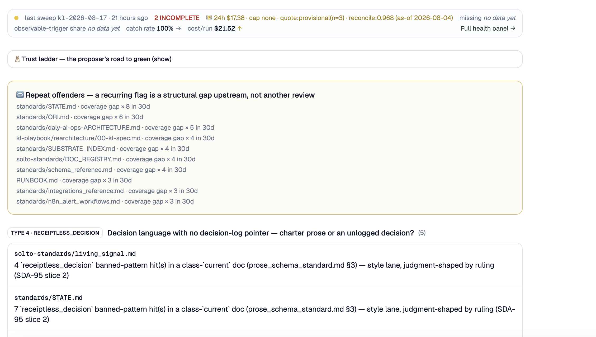

# The Knowledge Layer

Companies move fast and their documentation doesn't. Docs go stale because maintaining them takes too long, so knowledge lives in people's heads and turnover gets risky. Decks take weeks of creation and review, with a version for every audience. Most people spend up to 80% of their day in repetitive meetings, Slack, and email. The strategic signal is in there somewhere, but the company is too busy reacting to go find it.

Now add AI agents to that. Agents don't remove the bottleneck, they move it, and if they're reading from stale or thin context they turn it into risk. I learned this the direct way, running my business on agents that were acting on docs that were true for about two days each. Confidently wrong costs more than never starting. So I built the layer underneath first: a knowledge layer that keeps its own docs honest. Then I got excited about what that makes possible when it's done right.

This repo is a curated excerpt of that system. The full repo is private because it runs my business, client work and live infrastructure included. Happy to walk anyone through it live.

## What this is

- A self-healing knowledge layer: deterministic checks, drift detection, and eval that keep a doc canon correct
- I am client zero. It runs on its own docs, daily, in production
- **3,014** tests. **41** deterministic freshness checks. One judge that says "uncertain" instead of guessing

## How it works

Three lanes, in order of cost:

- **Write-time**: 35 deterministic checks at pre-commit. Pointer rot, count drift, supersession, cross-doc consistency. If it's computable, no LLM is involved, and a failure blocks the commit
- **Scheduled sweep**: catches what slips past commits. Mechanical drift gets fixed into a PR. Judgment calls go to a human. Always
- **Semantic judge**: claims judged against the code as it is now, and every verdict cites file:line. It proposes, you decide

The full picture, diagram included: [docs/01-architecture.md](docs/01-architecture.md)

## See it running

The judgment queue mid-review. Evidence pinned to a snapshot, and the verdict is mine to make:

The health strip doing its job: an incomplete sweep flagged instead of hidden, cost per run on the meter, and repeat offenders named as structural gaps, not more review:

## What's in this repo

| Excerpt | What it shows |
|---|---|
| `drift_sweep.py` | The detect-and-fix engine. Splits drift into "computable fix" and "needs a human" |
| `judge.py` | The grounded judge. Keep-by-default, cites its evidence, never writes |
| `memo.py` | Verdict memoization. Unchanged inputs never get re-judged |
| `budget_guard.py` | A fail-closed spend ceiling. It halts the run, it doesn't just alert |
| `errors.py` | The structured error shape. Nothing fails silently |
| `freshness_checks/pointer_rot.py` | One deterministic check of the 35 |

Every module docstring answers the same four questions: what it expects, what it guarantees, what it does when something is missing, and who depends on it next. That convention is the knowledge layer applied to code.

## The story

Three questions, each answered with a measurement: how do we prevent drift, how do we detect it, and how do we make sure it's right. [docs/02-drift-outcomes.md](docs/02-drift-outcomes.md)

## What this unlocks

A trustworthy knowledge layer is not a docs chore. It's the ground for everything you'd actually want agents to do:

- Reporting that writes itself, with the insights attached
- Content loops wired to analytics, so what landed feeds what gets written next
- A deck in minutes, current as of this morning, one version per audience without the versioning circus
- A roadmap or an architecture doc spun up from the code and the docs as they actually are
- Meeting notes that turn into content and customer signal instead of dying in a drive
- Less reactive mode, because the strategic signal stops getting lost in the noise

None of that is safe to automate on stale docs. All of it is sitting there once the docs can be trusted.

## Where it's going

- More sockets (Notion, Obsidian, any MCP source) onto the existing spine, since the ingestion contract is already source-agnostic
- The deterministic floor stays the engine. The LLM is the escalation path, not the default
- A thin structural layer instead of a fact-graph. The graph was the expensive, low-trust path, so it got cut

The tech will keep changing but the ground underneath will not.
