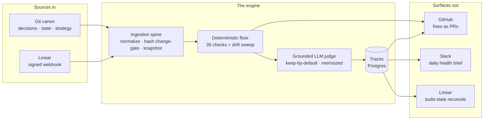
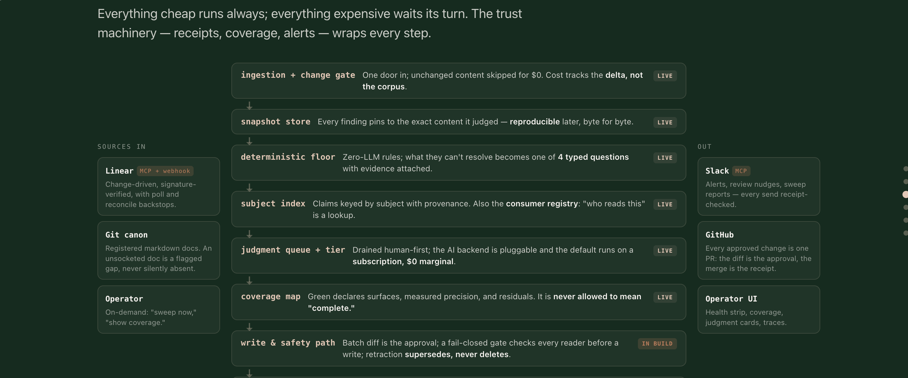

# Architecture

A knowledge layer that keeps its own canon honest. Runs daily, in prod, on the docs that run my business.

## The shape

The same shape as a working surface, with live / in-build status per stage:

## In

- One canonical-markdown contract: the spine is source-agnostic; anything that emits text sockets in
- Every source normalizes, content-hashes, and snapshots; **unchanged docs cost $0**
- Live sockets: Git canon · Linear (signed webhook)

## The engine: three lanes

- **Write-time**: 35 deterministic checks at pre-commit: pointer rot, count drift, supersession, cross-doc consistency. Computable means no LLM. A failure blocks the commit.
- **Scheduled sweep**: catches what slips past commits. Mechanical drift → auto-fixed into a PR. Judgment calls → a human. Always.
- **Semantic judge**: claims judged against the code as it is now; every verdict cites file:line. Uncertain > wrong. Proposes, never writes.

## Out

- **GitHub**: mechanical fixes arrive as reviewable PRs, never direct writes
- **Slack**: daily health brief: did the whole loop run?
- **Linear**: spec ⇄ tracker reconciliation on the build pillar

## Design rules

- **Deterministic first**: the LLM only sees what can't be computed
- **Keep by default**: a false "drift" flag costs more than a missed one; noise burns operator trust
- **Propose only**: no LLM write path to canon, ever
- **Fail loud**: an API error mints an explicit `failsafe` verdict, never a silent pass
- **One asserter per fact**: every fact has one owning doc; drift can't exist if it can't be written twice

## Production spine: governance built in, not bolted on

**Traceability**
- Every verdict cites file:line and carries the verbatim span it judged
- Pinned snapshots + content hashes, so every finding is reproducible after the fact
- `run_manifest`, the run-completeness contract: traces record what happened, the manifest catches what never started

**Auditability**
- `write_audit`: every external write leaves one queryable receipt
- `spend_ledger`: every dollar lands in one append-only stream (the money half of the receipt pair)
- Scoped DB roles + RLS · secrets fail closed at startup

**Evals**
- The golden set grows from normal review: every human ruling becomes a labelled fixture
- `fixture_eval` scores the judge against those labels; check types graduate at measured precision, auto-demote on decay

**Observability + alerts**
- OpenTelemetry GenAI spans on every LLM call
- External dead-man switch + a scheduled synthetic canary, because a quiet system and a dead system look identical, and silence has to be provable
- Daily Slack health brief: did the whole loop run?

**Cost controls**
- Hash change-gate: unchanged docs cost $0
- Verdict memoization: identical inputs replay, never re-spend
- `budget_guard`: a fail-closed ceiling that halts the run, not just alerts

## Where it's going

- More sockets (Notion, Obsidian, any MCP source) onto the existing spine, since the contract is already source-agnostic
- Deterministic floor stays the engine; LLM is the escalation path
- Thin structural layer instead of a fact-graph. The graph was the expensive, low-trust path, so it got cut
